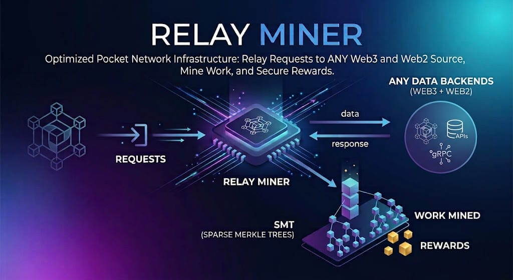

# Pocket RelayMiner



**Every relay you serve, paid on chain.**

Pocket RelayMiner is the supplier side of Pocket Network: it serves relays from
gateways to your backends on every transport, charges each one against the
application's stake before serving it, and turns what it served into claims and
proofs that settle on chain -- through crashes, restarts, Redis outages and
partial rejections.

> **Measured for v0.1.0** on 1 relayer, 1 miner and 1 Redis: **10.7 M relays
> served at ~2,400 relays/s**, through 4 session windows with 6 sessions of 50
> suppliers each, and **1,501 of 1,501 claims settled**, with the miner killed
> twice on purpose along the way. The numbers are in the
> [capacity report](docs/benchmarks/v0.1.0/Relay-Miner-Capacity.pdf).

## Why operators run it

**It gets every relay paid**
- Claims and proofs are submitted automatically for every session, and watched
  until the chain includes them; what did not land is resubmitted while its
  window is still open.
- A claim or a proof is never lost to a crash, a rollout or a batch the chain
  partly refuses: the message the chain names leaves the batch, the rest goes
  through.
- Every relay is charged against the application's stake before it is served,
  so the relayer does not serve work the session can no longer pay for. If Redis
  cannot confirm the budget, the relay is refused rather than served for free.

**It serves every transport**
- JSON-RPC over HTTP, WebSocket, gRPC, REST and streaming (SSE), and CometBFT,
  routed to your backends per service.
- Ring signatures and sessions are verified on every relay, and every response
  is signed with the supplier's key.

**It scales and survives failure**
- Relayers keep no state of their own: all of it lives in one Redis, which
  every relayer and miner of a deployment shares.
- Miners elect a leader through Redis; a standby takes over when it stops.
- Memory and Redis are bounded at every stage: under pressure it refuses new
  work cleanly instead of running out of memory.

**It refuses to run unsafe**
- `validate` checks a config offline and lists every problem in one pass;
  `--check-stake` finds staked services with no backend.
- Both processes refuse to start on a Redis that could lose data (no
  `maxmemory`, an evicting policy, a version older than 8.10).

**It shows you what it is doing**
- Prometheus metrics with a triage order for incidents
  ([docs/METRICS_TRIAGE.md](docs/METRICS_TRIAGE.md)).
- `pocket-relay-miner redis` decodes sessions, streams, claim trees, meters and
  every claim and proof submission straight from Redis.

**It is built to build on**
- `pocket-relay-miner relay` sends single relays and load tests on every
  transport, and **simulated relays** exercise a live relayer end to end without
  staking or billing anything ([docs/SIMULATED_RELAYS.md](docs/SIMULATED_RELAYS.md)).
- The bLSAG ring signature a relay carries is documented byte for byte, with
  working signers in Node.js, Python and Rust and a Go oracle to check yours
  ([examples/relay-signing/](examples/relay-signing/README.md)).
- Supplier keys come from a keys file or a keyring and reload without a restart
  ([docs/SUPPLIER_KEYS.md](docs/SUPPLIER_KEYS.md)).

## How it fits

```
                 gateways
                    │
        ┌───────────┼───────────┐
        ▼           ▼           ▼
   ┌─────────┐ ┌─────────┐ ┌─────────┐
   │ relayer │ │ relayer │ │ relayer │ ──> your backends
   └────┬────┘ └────┬────┘ └────┬────┘     (stateless: validate, charge, serve, sign)
        └───────────┼───────────┘
                    ▼
               ┌─────────┐
               │  Redis  │  relays, claim trees, the stake meter
               └────┬────┘
            ┌───────┴───────┐
            ▼               ▼
      ┌──────────┐    ┌──────────┐
      │  miner   │    │  miner   │ ──> Pocket chain (claims, proofs)
      │ (leader) │    │(standby) │
      └──────────┘    └──────────┘
```

1 binary, 2 processes, 1 Redis shared by all of them, every process on the same
version. v0.1.0 was tested on 1 relayer + 1 miner and on 2 relayers + 2 miners
(the latter at lower load); the load tests and the capacity figures are from
1 relayer + 1 miner.

## Where to start

**Deploy.** An AI agent starts at [AGENTS.md](AGENTS.md): the rules and the
invariants that stop a deployment.

| I want to... | Read |
|---|---|
| choose a path, check prerequisites and ports | [docs/deploy/README.md](docs/deploy/README.md) |
| run it with Docker Compose, on beta first | [docs/deploy/DOCKER_COMPOSE.md](docs/deploy/DOCKER_COMPOSE.md) |
| run it on a host, binary and systemd | [docs/deploy/HOST.md](docs/deploy/HOST.md) |
| use Kubernetes | no example in v0.1.0; `tilt/` runs the stack on a local kind cluster and is a starting point for your own manifests |

**Configure.** The relayer reads its config once, at startup: restart it after
every change.

| I want to... | Read |
|---|---|
| see every key, its default and why to change it | [config.relayer.example.yaml](config.relayer.example.yaml), [config.miner.example.yaml](config.miner.example.yaml) |
| check a config against its schema | [config.relayer.schema.yaml](config.relayer.schema.yaml), [config.miner.schema.yaml](config.miner.schema.yaml), and `pocket-relay-miner relayer\|miner validate --config <file>` |
| set up Redis | [config.redis.example.conf](config.redis.example.conf) |
| set up supplier keys | [docs/SUPPLIER_KEYS.md](docs/SUPPLIER_KEYS.md) |
| start from a minimal config that works | [examples/docker-compose/config/](examples/docker-compose/config/), [examples/host/](examples/host/) |

**Operate.**

| I want to... | Read |
|---|---|
| fix a deployment that does not start or does not serve | [docs/deploy/TROUBLESHOOTING.md](docs/deploy/TROUBLESHOOTING.md) |
| know what changed in a version, and what to do before upgrading | the release notes of each version: <https://github.com/pokt-network/pocket-relay-miner/releases> |
| run Prometheus and Grafana with ready dashboards | [examples/observability/](examples/observability/README.md) |
| know which metrics to read, in order | [docs/METRICS_TRIAGE.md](docs/METRICS_TRIAGE.md), and [scripts/observability/triage.sh](scripts/observability/triage.sh) to check them against Prometheus |
| inspect what is in Redis | `pocket-relay-miner redis --help`; what each key holds: [docs/REDIS.md](docs/REDIS.md) |
| size memory, CPU and Redis for your load | [docs/benchmarks/](docs/benchmarks/README.md): the v0.1.0 capacity report and how to read it |

**Test and measure.**

| I want to... | Read |
|---|---|
| send a relay or a load test to a relayer, on any transport | [docs/testing/DIRECT_CLI.md](docs/testing/DIRECT_CLI.md) |
| test a live relayer without staking or billing | [docs/SIMULATED_RELAYS.md](docs/SIMULATED_RELAYS.md) |
| size the connection pool for each backend | [scripts/loadtest/README.md](scripts/loadtest/README.md) |
| sign a relay from another language | [examples/relay-signing/](examples/relay-signing/README.md) |

**Understand.**

| I want to... | Read |
|---|---|
| follow a relay into a claim, a proof and a reward | [docs/CLAIM_PROOF_LIFECYCLE.md](docs/CLAIM_PROOF_LIFECYCLE.md) |
| know when two relays count as one | [docs/CLAIM_LEAF_MODEL.md](docs/CLAIM_LEAF_MODEL.md) |
| learn the protocol per entity, and where the money moves | [docs/protocol/](docs/protocol/README.md) |
| know what a gateway, the relayer and a backend expect of each other | [docs/PROTOCOL_SPEC.md](docs/PROTOCOL_SPEC.md), [docs/WEBSOCKET_HANDSHAKE_PROTOCOL.md](docs/WEBSOCKET_HANDSHAKE_PROTOCOL.md) |

**Develop.** [CONTRIBUTING.md](CONTRIBUTING.md): the package map, the
development environment, the workflow and every rule for changing the code.
Testing guides: [docs/testing/](docs/testing/README.md) and
[scripts/README.md](scripts/README.md).

## License

MIT License - see [LICENSE](LICENSE)
